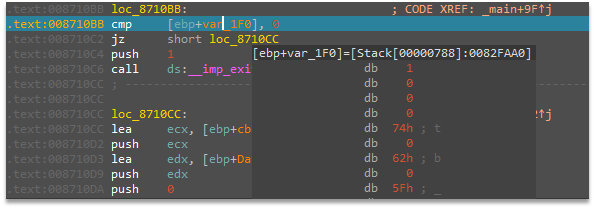
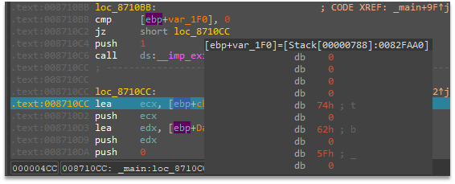
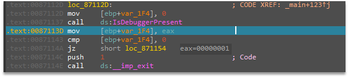
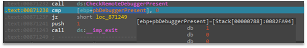
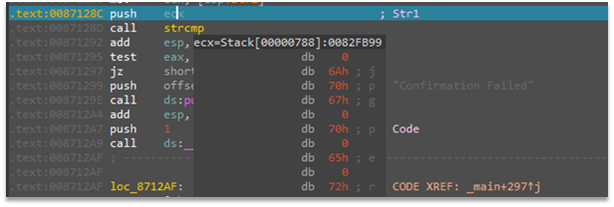
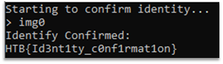

# Confirmation of Identity
We get a PE file idconfirm.exe. After analyzing the program, we can see, that it is simply read the HKEY_CURRENT_USER\Control Panel\Desktop\Wallpaper key, take the filename and extension from it, do some checks and decrypt flag, if the checks pass.

To complete this task, we can run the program under debugger and do some patches while program execution.

The patches we need:
1. Patch value on [ebp+var_1f0] to zero to continue program execution.

After patch:

2. Patch the return value of IsDebuggerPresent function to zero.

3. Patch the value in [ebp+pbDebuggerPresent] to zero to bypass debugger check.

4. Patch the string on stack that ecx points to “\proof” string to make a strcmp function to return zero and to properly decrypt our flag.

After patch:

After that patches, program will decrypt a flag and return it to us:

