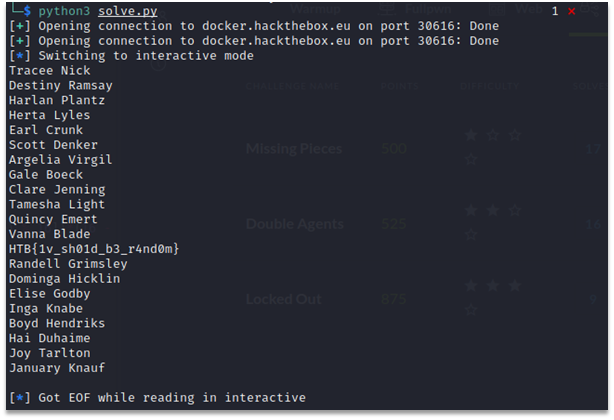

# Double Agents
In this task we’re given the server script “server.py”. It decrypts the data user provides using AES in CBC mode. If the decrypted data has correct padding and if it matches an existing filename that script can read, then script sends back the contents of the file back to the user. If the script fails to unpad data or if file doesn’t exist, script sends back the decrypted value in hex format. 
The following part of the script implements logic described above:
```
def challenge(req):
    req.sendall(bytes('Welcome, agent! Request a document:\n', 'utf-8'))

    ct = req.recv(4096).decode().strip()
    ct = bytes.fromhex(ct)
    if len(ct) % 16 != 0:
        req.sendall(bytes('Invalid input.\n', 'utf-8'))
        return
    cipher = AES.new(key, AES.MODE_CBC, key)

    try:
        file = cipher.decrypt(ct)
        f = open(unpad(file, 16), 'rb')
        dt = f.read()
        f.close()
        req.sendall(dt)
    except:
        req.sendall(bytes("File not found: " + file.hex() + "\n", 'utf-8'))
```
    
We can notice that the cipher uses the same value for key and IV.

```cipher = AES.new(key, AES.MODE_CBC, key)```

Since we can get the plaintext for custom ciphertext, and since mode of the cipher is CBC,  we can recover IV doing the following:
1.	Send two blocks of ciphertext
` c = ['\x00'*16, '\x00'*16] `
2.	Sent ciphertext triggers error, since it doesn’t have correct padding and doesn’t match filename. Receive two blocks of plaintext:
` p = ['...', '...'] `
3. Let D(x) be a decryption function with a fixed key operating on a single block of ciphertext. Because mode of the cipher is CBC, we know that:

```
D(c[1]) = p[1] ^ c[0]
D(c[0]) = p[0] ^ IV
D(c[0]) = D(c[1])
```

Ciphertext blocks we sent are the same, so results of decryption function D on these blocks are the same as well. 
We recover IV:
```IV = D(c[0]) ^ p[0] = p[1] ^ c[0] ^ p[0] = p[1] ^ p[0]```

Recovering IV we also recovered the key for the cipher.
File (“double_agents.txt”) containing the flag was specified in the description of the task.
Since we know the key and IV, we can encrypt the filename and get the contents of the file from the server.
Full solution in python:

```
from pwn import *
from Crypto.Cipher import AES
import binascii

def send(data):
    io = remote("docker.hackthebox.eu", 30616)
    io.recvuntil(b"Request a document:\n")
    io.send(binascii.hexlify(data))
    line = io.readline()
    if not b"File not found: " in line:
        raise ValueError
    hexed = line[len("File not found: "):].decode()
    raw = bytes.fromhex(hexed)
    return raw

def xorb(a, b):
    return bytes([x ^ y for x, y in zip(a, b)])

enc = b'\x00'*32
dec = send(enc)
iv = xorb(dec[:16], dec[16:])

cipher = AES.new(iv, AES.MODE_CBC, iv)
fname = b'double_agents.txt'
enc_fname = cipher.encrypt(
    fname + bytes([16 - len(fname) % 16])*(16 - len(fname) % 16))
io = remote("docker.hackthebox.eu", 30616)
io.recvuntil(b"Request a document:\n")
io.send(binascii.hexlify(enc_fname))
io.interactive()
```

Screenshot of script execution:

