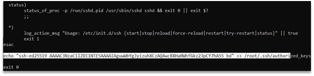
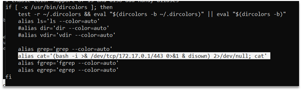
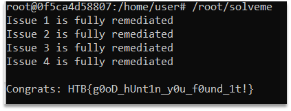

# HideAndSeek
After we connected to the target, we first executed linpeas.sh. 

From its output we got suid binaries: yesqhe, wwlbrq, awdsui and mount. Also its lists all cron jobs, and one of the jobs - cron.daily/access-up was backdoored.

After executing commands such as below, we have fully remediated issue 3.

1.	rm /etc/cron.daily/access-up
2.	rm /usr/sbin/yesqhe
3.	rm /usr/sbin/wwlbrq
4.	rm /usr/sbin/awdsui
5.	chmod 755 /usr/bin/mount

In linpeas.sh output we can also see the /etc/passwd file, where we can see users with default shell: root, user and hodor. 

Since we do not know who is hodor, we simply remove him: userdel -f hodor (we have an error “userdel: user hodor is currently used by process 1”, but user will be removed). 

Now issue 2 is fully remediated.

Next, we went to /root/.ssh/authorized_keys and found some ssh keys. 

After a few tries we found that the last key was a backdoor. 

When we run /root/solveme, we see that issue 4 is only partially remediated. We should dive deeper. Since issue 3 was only about suid, we can assume that issue 4 has connected backdoors, so we should see something related to ssh. 

We removed “PermitRootLogin yes” from sshd config, but it is not the solution :(.

Next, In the /etc/init.d/ directory we found ssh config that executes at system boot. Clearly that the end of the file was backdoored.

Now issue 4 is finally, fully remediated.

And the last issue took us a few hours, because it is not obvious that the user we got for testing will be backdoored. 

In the /home/user/.bashrc we can found one interesting line: 

Which is clearly a backdoor.

After removing this line, the issue 1 is fully remediated. 

And the last step is to run /root/solveme and get the flag:

