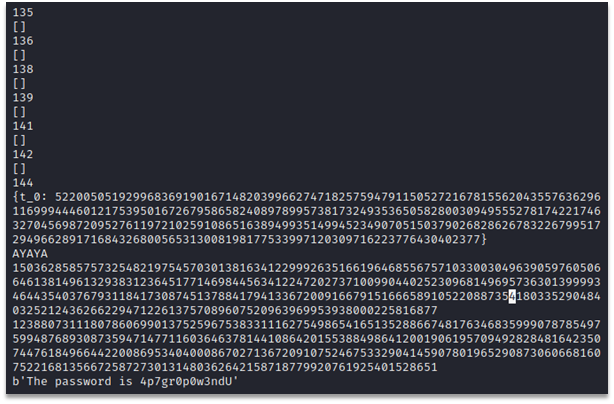
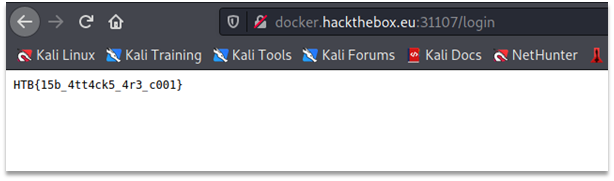

# Locked Out
In this task we’re given the python script that encrypts user provided data with textbook RSA and outputs ciphertext to a file. We’re also given additional output from the script containing RSA modulus n and values rp, rq from the prime generation algorithm. 
The following function is used to generate primes:

```python
def generate_prime(bits):
    m = 2
    while True:
        a= getrandbits(bits)
        a = a**m
        prime = None
        r = None
        for i in range(2*a):
            if gmpy2.is_prime(a +i):
                prime = a +i
                r = i
                break
        if prime is None: continue
        return prime, r

p, rp = generate_prime(512)
q, rq = generate_prime(512)
```
We can see that primes are of the following form:
`p=a^2+r_p`
`q=b^2+r_q`
Then for the modulus n we have:
`n=p⋅q=(ab)^2+a^2 r_q+b^2 r_p+r_p r_q`
We can notice that ab contributes a significant part to the value of n. So by extracting square root from n we get good estimate of the ab value:
`n^(1/2)=ab+s,`
where s is a small value (in a range of few thousands).
Assuming we found correct value of ab the following holds true:
`a^2 r_q+b^2 r_p=n-(ab)^2-r_p r_q=y, or
a^2 r_q+b^2 r_p=y`
which is a diophantine equation. It has solutions only and if only gcd(r_p,r_q)|y. For correct value of ab the diophantine equation will have solutions, so we can filter out some incorrect values of ab by checking if gcd(r_p,r_q)|y.
Next, we solve diophantine equation and get parametric solution in the form:

`u_0 t +v_0  =a^2`
`u_1 t +v_1  =b^2`
where t is a varying parameter and t∈Z.
Multiplying both parts of parametric solution we get:
`(u_0 t+v_0)⋅〖(u〗_1 t +v_1)=u_o u_1 t^2+(u_0 v_1+u_1 v_0)t + v_0 v_1=(ab)^2`
This is quadratic equation, and we have the assumed value of ab. So next we solve the quadratic equation and check if it has integer solutions. For each integer solution we compute values of a^2,b^2 and then check if `n=(a^2+r_p)⋅(b^2+r_q)`, thus factoring the RSA modulus. 
Full solution using sage and python (runs a few seconds):
```python
from sage.all import *
from Crypto.Util.number import inverse, long_to_bytes

n = 18627060853366003817633498319725128072935605420672144028180887821598995058566763870406708181052681986936527075954895204088200290386963730876047423903233595643471077586653831691013827267874620159258094222853259785361633293190228850242828942973252729075142510154777682987087560910570468443515976133521357279350135180187709921165306439775516983770374718903851808402718506713073936579721447055524042778187890314247383276126544626388594005451861656297486009721524593236438272682590796161812616558556489424502887789415628561091674949871825109470840186278129161368348123380425008804948098905894644488816022732318170994842927
rp = 228
rq = 75

g = gcd(rp, rq)
s = 1
# bruteforcing s = isqrt(n - rp*rq) - ab
# s is in the range of few thousands
while True:
    ab = isqrt(n - rp*rq) - s
    y = n - rp*rq - ab*ab
    # checking if diophantine equation have solutions (gcd(rp, rq) divides y)
    # if not, we skip current value of s
    if y % g != 0:
        s += 1
        continue
    
    # solving diophantine equation using sympy sage integration
    w1, w2 = var('w1, w2')
    assume(w1, 'integer')
    assume(w2, 'integer')
    sol = solve_diophantine(w1*rq + w2*rp == y)

    # solving quadratic equation in integers
    t_0 = var('t_0')
    assume(t_0, 'integer')
    tt = solve(sol[0]*sol[1] == ab*ab, t_0, solution_dict=True)
    print(tt)
    # quadratic equation has only one solution, then tt - dict
    if isinstance(tt, dict):
        ag = sol[0].subs(t_0=tt[t_0])
        bg = sol[1].subs(t_0=tt[t_0])
        p = ag + rp
        q = bg + rq
        if p*q == n:
            print('AYAYA')
            print(p)
            print(q)
            break
    # quadratic equation has two solutions (not possible probably), tt - list of dicts
    elif isinstance(tt, list):
        for qsol in tt:
            ag = sol[0].subs(t_0=qsol[t_0])
            bg = sol[1].subs(t_0=qsol[t_0])
            p = ag + rp
            q = bg + rq
            if p*q == n:
                print('AYAYA')
                print(p)
                print(q)
                break
    s += 1
    print(s)

# p = 150362858575732548219754570301381634122999263516619646855675710330030496390597605066461381496132938312364517714698445634122472027371009904402523096814969573630139999346443540376793118417308745137884179413367200916679151666589105220887354180335290484032521243626622947122613757089607520963969953938000225816877
# q = 123880731118078606990137525967538331116275498654165135288667481763468359990787854975994876893087359471477116036463781441086420155388498641200190619570949282848164235074476184966442200869534040008670271367209107524675332904145907801965290873060668160752216813566725872730131480362642158718779920761925401528651

m = 0x15f8468e603cfe7eca368ebf666b98d918686148336e2ffae048dc7dc7d4a399b1c6bff22140a79628c6a66e8d85fcc2d39505f15ec77295d373091c56a57de9472adf673d56307fa7fd2c7a3e2dc2d57c9380a5d332aa4c3592c08da22aa82667ebe7536a104e814c3f06dff9632f26fff3e52c711416abded102fa5377fce6dadcad3ac4d6197da69002817d00d3f765e71d73070fe1d5b1d8f1bf9a148ea026371c2d19debe317d96e9f1911f07286f90b8d9f9ff35d6b886f2f9b171b112f27e96c199e6f70501b282475c5ade73abe1c6bf39aada6507ab080aeccd11942171d83a28fb9c5aaeb7b40cf0a628946d6d46c40534e2fd3d65bf6e718435ce
d = inverse(65537, (p-1)*(q-1))
# print(d)
print(long_to_bytes(pow(m, d, n)))
```
Running the script above we get password for the admin panel:



Using the password “4p7gr0p0w3ndU” and username “admin” we get the flag:


