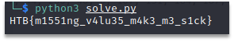

# Missing Pieces
We’re presented with the file “flag.txt” containing 32 lists of numbers. Each list consists of 255 different numbers in range [0, 255] (256 possible values). We can notice that only one value from range [0, 255] is missing from each list, hence the name of the task is “Missing Pieces”. Combining missing values from each list we get the flag.
Solution in python:

```
# lists from file flag.txt
data = [[...]]

ans = []
for v in data:
    for i in range(256):
        if i not in v:
            ans.append(i)

ans = ''.join(map(chr, ans))
print(ans) 
```

Screenshot with script execution:

