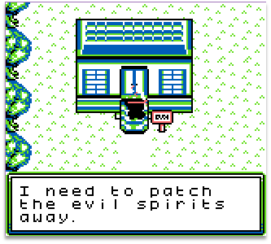
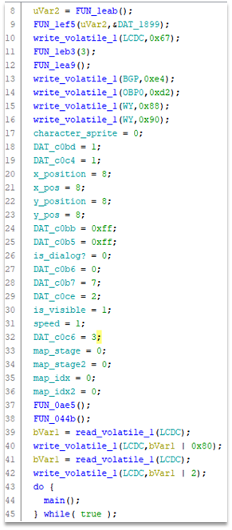
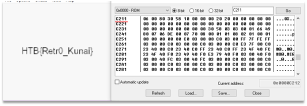

# Patch of the Ninja

First, open the Game Boy ROM file in the emulator and look around. According to the description, it seems that it is necessary to get into the house, while the entrance is blocked, and something needs to be done.
 

During the display of the dialog, according to the logic, some infinite loop should occur until the key is pressed or something like this. So, get a backtrace at this moment:

From these addresses we can start reversing the code. “$1e3f” is a function with a halt. “$197b” is a function that implements the main logic of the game. “$1970” is kind of initialization function.

To understand what variables in the function “$1970” do, we can change them at runtime through the debugger. This will make the code easier to understand. Changing the value of the variable at “$c211” we can notice that it changes the current map. Trying adjacent values to the original one, we find a map with a flag display.

