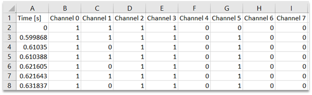

# Remote

After some googling we found that .sal file and SALEAE in each file inside can be opened in Logic 2.* program.


After trying all the algorithms in logic, we assume that this is some custom stuff. We can see that value in one channel in 1-4 and value in one channel in 5-8 is symmetrical. Now we can write this signal as 8 bits.

For example:
0100-0100;1000-0100; 0100-1000; etc;
Now we should parse it somehow. Logic offers export to the csv file function, which we will use.



So, the first symbol is 0100 - 0100. It does not look like ascii or smth, so we assume that this is the position on the keypad.

Now we assume that we have a keypad such as below (because why not?).


For example, 0100 - 0100 on the keypad it is 5. We get it like this:
Keypad:
xxxx
x*xx
xxxx
xxxx
The code on C# to get our passwords:

```C
using System;
using System.IO;
using System.Linq;

namespace ConsoleApp26
{
    class Program
    {
        static void Main(string[] args)
        {
            bool SwapAxis = true;
            bool InverseAxis = false;

            using (var reader = new StreamReader(@"C:\Users\kukuxumushi\Downloads\Downloads\hw_remote (1)\csv.csv\digital.csv"))
            {
                string keypad =
                    "123A" +
                    "456B" +
                    "789C" +
                    "*0#D";

                reader.ReadLine();//skip headers

                string prev_state = "";
                while (!reader.EndOfStream)
                {
                    string row = reader.ReadLine();
                    if (string.IsNullOrWhiteSpace(row))
                        continue;
                    //delete time
                    row = row.Substring(row.IndexOf(',') + 1);

                    //skip illegal states
                    if (row != "1,1,1,1,0,0,0,0" && (row.StartsWith("1,1,1,1,") || row.EndsWith(",0,0,0,0")))
                        continue;
                    //skip empty state
                    if (row == "1,1,1,1,0,0,0,0")
                        continue;
                    //skip multiple press states(jitter)
                    if (prev_state == row)
                        continue;

                    prev_state = row;
                    var nums = row.Split(',').Select(v => Convert.ToInt32(v)).ToArray();

                    int X = GetNum(nums, 0);//Get pos from first  4 channels
                    int Y = GetNum(nums, 1);//Get pos from second 4 channels

                    if (InverseAxis)
                    {
                        X = 3 - X;
                        Y = 3 - Y;
                    }

                    if (!SwapAxis)
                        Console.Write(keypad[X + Y * 4]);
                    else
                        Console.Write(keypad[Y + X * 4]);
                }
            }
        }
        static int GetNum(int[] ch, int pos)
        {
            if (pos != 0 && pos != 1)
                throw new Exception();
            if (pos == 0)
            {
                for (int i = 0; i < 4; i++)
                    if (ch[i] == 0)
                        return i;
            }
            else
            {
                for (int i = 0; i < 4; i++)
                    if (ch[4 + i] == 1)
                        return i;
            }
            throw new Exception();
        }
    }
}
```

Now we got 4 possible passwords:
1.	5424*D2B10*7286B*364742*DB1B4B7*#D
2.	5242AD401BA34680A782324AD010203ACD
3.	9C#CA1#7D3AB#687A08CBC#A17D7C7BA21
4.	9#C#*1C3D7*0C863*B6#0#C*13D3#30*41
4 passwords are because we don’t know from which side/angle we start.
Trying all the password one by one:


Looks like the flag is wrong.


HTB{m4721c35_423_v32y_c0mm0n_1n_3m83dd3d_d3v1c35!@&325$}

