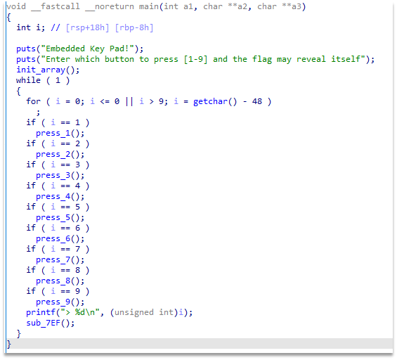
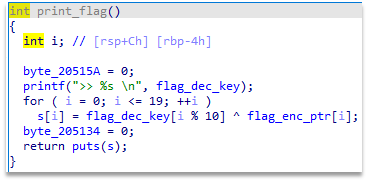
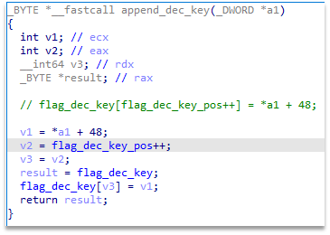
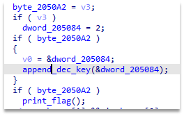
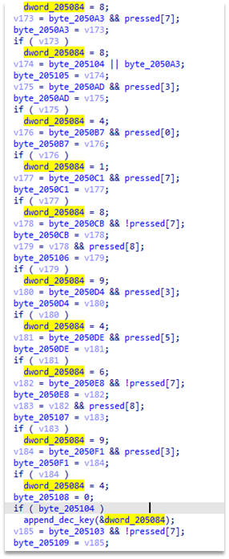
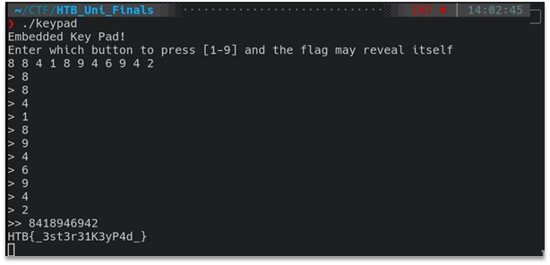

# Sychronous Keypad
We get an x64 elf file.

Opening it in IDA Pro and looking at the main function, we see that each digit is processed by its own function (renamed as press_ *), and after each press, the sub_7EF function is called.



If we look at all the functions that process the input of numbers, then you can understand that they are of the same type and they can be written in general form as:

```
void press_X() {
    pressed[X - 1] = 1;
}
```

And the sub_7EF function is responsible for processing the input of numbers.
It is not clear from the function itself how it performs work, but looking at the functions it calls, you can understand that:

The function at the address 0x3BD5 (print_flag) decodes the flag by xoring it with some key, and then outputs it:



The function at 0x3C7C (append_dec_key) appends a new value to the key:



By tracing the calls to the append_dec_key function, you can see that the values for the call are selected in 2 places:

Before calling the output of the flag:



At the end of the function:



Looking at all this, we get the numbers:
8 8 4 1 8 9 4 6 9 4, and add 2 to them, which is added just before the flag is displayed.
We check the resulting combination 8 8 4 1 8 9 4 6 9 4 2 and get the flag:


