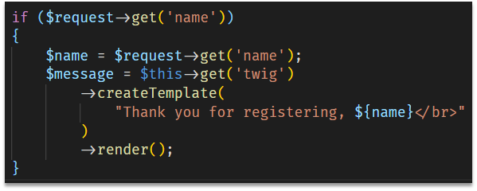
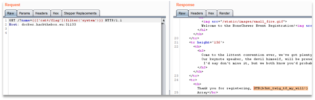

# baby bonechewercon
We are given an archive with a docker image for the challenge. It is a Twig application that is vulnerable to Server-Side Template Injection. It allows us to execute any code on the server and get the flag. 

 
After submitting `{{['cat /flag']|filter('system')}} ` as the name we get the flag.
 
