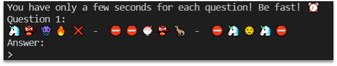
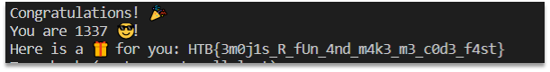

# mathemoji

When we connect to the docker we see such message:
 


There are some mathematical problems that we need to solve. But instead of numbers there are emojis.

If we run it a few times, we will see that there are only 10 emojis, so we can assume that each emoji corresponds to one number. So the task is to find corresponding numbers and solve this problems 100 times.

Fully automated POC/solver:

```python
import socket
import itertools
import re

host = "docker.hackthebox.eu"
port = 31080

def education():
    substitut = {'🍨': None, '🍧': None, '🌞': None, '🦖': None, '❌': None,
                 '🦄': None, '👺': None, '🔥': None,  '👾': None,  '⛔': None}
    print('looking for nice equation.....')
    while True:
        client_socket = socket.socket()
        client_socket.connect((host, port))
        data = client_socket.recv(2024).decode()
        data = client_socket.recv(2024).decode()
        match = re.search(
            r"Question \d{1,3}:\n(.+)Answer:", data, re.MULTILINE | re.DOTALL)
        question = match.group(1)
        client_socket.send(str(123).encode())
        data = client_socket.recv(2024).decode()
        solution = ''
        try:
            answer = int(
                re.search(r"The correct answer was ([-\d]{1,})", data).group(1))
            if '*' in question and ('+' or '-') in question:
                print('bruteforcing equation.....')
                for numbers in list(itertools.permutations([0, 1, 2, 3, 4, 5, 6, 7, 8, 9])):
                    dictionary = {"🍨": numbers[0], "🍧": numbers[1], '🌞': numbers[2], '🦖': numbers[3], '❌': numbers[4],
                                  '🦄': numbers[5], '👺': numbers[6], '🔥': numbers[7], '👾': numbers[8], '⛔': numbers[9]}
                    equation = question
                    for word, initial in dictionary.items():
                        equation = equation.replace(
                            word, str(initial)).replace(" ", '')
                    equation = re.split(r'([\+\-*\/])', equation)
                    equation = ''.join([re.sub(r'^0+', '', part)
                                        for part in equation])
                    result = int(eval(equation))
                    if result == answer:
                        if solution != '':
                            if equation == solution:
                                pass
                            else:
                                continue
                        else:
                            solution = equation
                solution = solution.replace(' ', '')
                question = question.replace('  ', ' ')
                for idx, val in enumerate(question):
                    if val in substitut:
                        if substitut[val] is None:
                            substitut[val] = solution[int(idx/2)]
                if None not in substitut.values():
                    print(substitut)
                    break
                else:
                    counter = 0
                    for value in substitut.values():
                        if value is None:
                            counter += 1
                    if counter == 1:
                        for number in '1234567890':
                            if number not in substitut.values():
                                for emoji, num in substitut.items():
                                    if num is None:
                                        substitut[emoji] = number
                                        break
                    else:
                        print(substitut)
                        print('looking for nice equation.....')
        except:
            pass
    return substitut

def solver(substitut):
    error_counter = 0
    while True:
        try:
            client_socket = socket.socket()
            client_socket.connect((host, port))
            print("solving the task...")
            while True:
                data = client_socket.recv(2024).decode()
                data = client_socket.recv(2024).decode()
                print(data)
                flag = re.search(r"HTB{.+}", data)
                if flag is not None:
                    print(flag.group(0))
                    quit()
                match = re.search(
                    r"Question \d{1,3}:\n(.+)Answer:", data, re.MULTILINE | re.DOTALL)
                equation1 = match.group(1)
                for word, initial in substitut.items():
                    equation1 = equation1.replace(
                        word, str(initial)).replace(" ", '')
                equation1 = re.split('([\+\-*\/])', equation1)
                equation1 = ''.join([re.sub(r'^0+', '', part)
                                     for part in equation1])
                answer = eval(equation1)
                client_socket.send(str(answer).encode())

        except Exception as e:
            print("something went wrong, retrying....")
            error_counter += 1
            if error_counter == 10:
                print("looks like we made a bad dictionary, trying again.....")
                substitut = education()
                error_counter = 0
            print(e)

substitut = education()
solver(substitut)
```

At first we are trying to find equation with ‘*’ and (‘+’ or ‘-’) signs. Then we will bruteforce all possible combinations until we will fulfill our dictionary with corresponding values.
Now we got our dictionary, like this one:
{'🍨': '1', '🍧': '6', '🌞': '0', '🦖': '3', '❌': '2', '🦄': ‘9’, '👺': '7', '🔥': '4', '👾': '8', '⛔': '5'}
Then we can solve all 100 equation in the loop and get flag

