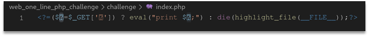
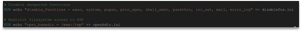
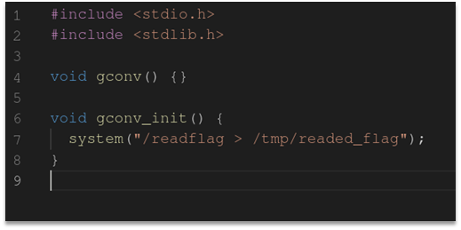
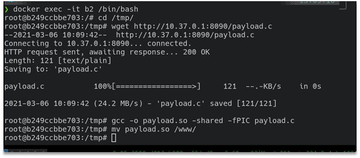
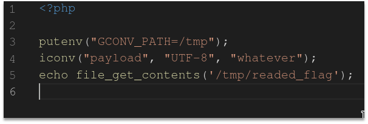
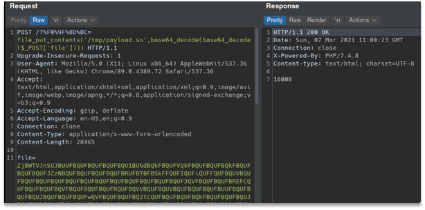
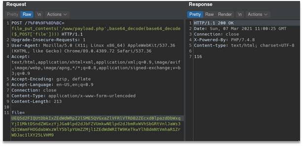
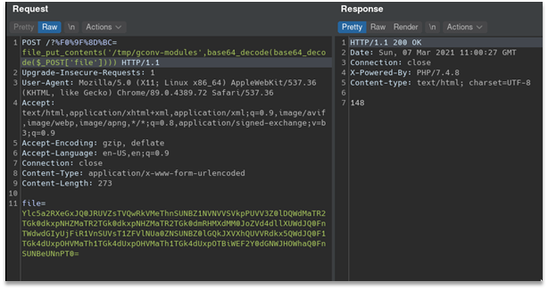
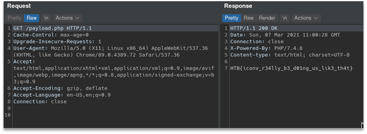

# one line php challenge
We were given an archive with a docker image for the challenge. To get the flag we need to run a suid binary file. Challenge itself is simple: we have php code injection with disable_functions for every system exec function, also there is open_basedir set to /www and /tmp directories:

All we need to know to solve the challenge - php was compiled with iconv enabled:

There is a disable_function bypass using iconv in php: https://gist.github.com/LoadLow/90b60bd5535d6c3927bb24d5f9955b80.
And yes, we do not have putenv disabled, so we can easily use it. 
We’ve prepared a payload that runs /readflag binary and writes output to /tmp directory which is accessible for us:

Compiled it on local challenge copy’s container:

And we wrote a simple php script which runs our payload and prints a flag:

So, we just need to upload and execute it. To do so we base64’d all files two times to upload it as is using following command `base64 -w 0 payload.so | base64 -w 0 > payload.so.b643 `
Here is exploitation process:

Flag: HTB{iconv_r34lly_b3_d01ng_us_lik3_th4t}