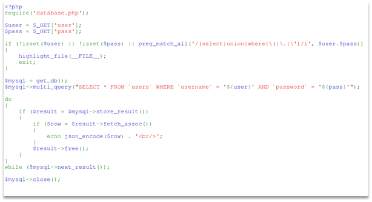
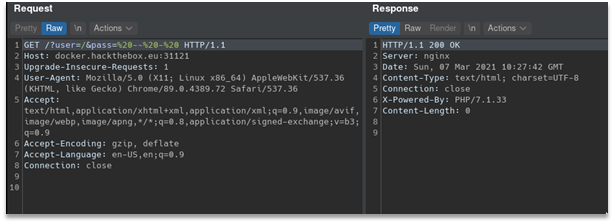
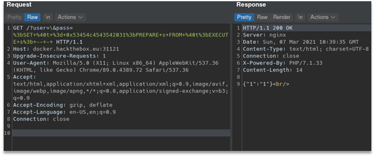
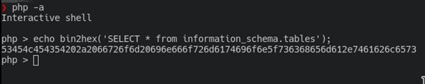
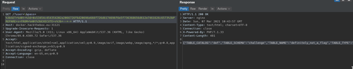
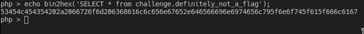
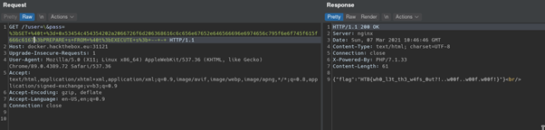

# wafwaf
We were given an URL for task instance which revealed us application’s source code:



Application constructs SQL query with user-provided user and pass parameters, but there is a regular expression check: provided params cannot contain select, where, union, dot sign, quote sign and opening bracket. So, we need to bypass this simple filter to get the flag from the database.
First, we need to escape from string context (between quotes). To do so we can simply put backslash before closing quote sign for username string. Also we put a mysql comment to make this query valid, but still it returned 0 rows. 



(my bad, screenshot contains regular slash instead of backslash, but we cannot make new screenshot now, anyway you got the idea)

We confirmed the bypass was working by debugging it using a local mysql server and going through source code again. Mysql queries were run by a multi_query function (https://www.php.net/manual/ru/mysqli.multi-query.php). So, we can put another query separated by semicolon. But we cannot use select, where and union words. 

Luckily, there are prepared statements in mysql itself (https://dev.mysql.com/doc/refman/8.0/en/sql-prepared-statements.html )! Also, we can use hex literals (https://dev.mysql.com/doc/refman/8.0/en/hexadecimal-literals.html) to bypass restrictions. So, we constructed following query to get SELECT 1:

```?user=\&pass=;SET @t = 0x53454c4543542031;PREPARE s FROM @t;EXECUTE s; -- - ```
(+ urlencode)

It worked as it should and returned us 1 which we selected. 
 


Now it’s time to get database structure. To do so I’ll construct query to information_schema database:
 



Now we know there is a database challenge with table definitely_not_a_flag. To complete a challenge, we need to construct simple query to get a flag:



 
And here is final request:

```GET /?user=\&pass=%3bSET+%40t+%3d+0x53454c454354202a2066726f6d206368616c6c656e67652e646566696e6974656c795f6e6f745f615f666c6167%3bPREPARE+s+FROM+%40t%3bEXECUTE+s%3b+--+-+ HTTP/1.1```

Flag: HTB{wh0_l3t_th3_w4fs_0ut?!..w00f..w00f.w00f!}
